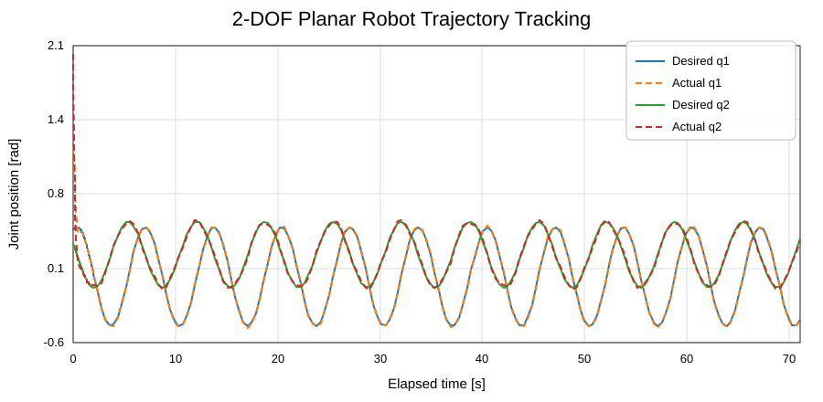
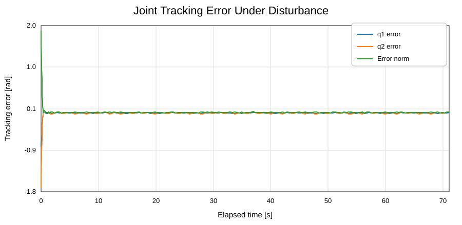

# ROS 2 Demonstration-Based Trajectory Tracking for a 2-DOF Planar Robot

A compact ROS 2 project for replaying a joint-space demonstration trajectory, tracking it with joint-space PD feedback, simulating two-link planar robot dynamics, injecting disturbances, logging the closed-loop response, and evaluating tracking performance quantitatively.

This repository is intentionally small and transparent. The focus is the complete **ROS 2 control workflow**—nodes, topics, launch configuration, simulation, logging, and offline analysis—rather than a high-fidelity robot model or a learning-based controller.

<p align="center">
  <b>ROS 2 · Python · PD Control · Robot Dynamics · Disturbance Injection · Tracking Analysis</b>
</p>

---

## System architecture

The package is organized as four communicating ROS 2 nodes:

```text
                    /desired_joint_states
/demo_trajectory_publisher --------------------+
                                               |
                                               v
                                      /pd_controller
                                               |
                                               | /control_torque
                                               v
                                  /planar_robot_dynamics
                                               |
                                               | /actual_joint_states
                                               +-------------------+
                                               |                   |
                                               +----> controller    |
                                                                   v
                                                    /tracking_error_logger
                                                                   |
                                                                   v
                                                        tracking CSV file
```

| Node | Role | Main rate |
|---|---|---:|
| `demo_trajectory_publisher` | Replays desired joint positions and velocities from CSV | 100 Hz |
| `pd_controller` | Computes saturated joint torque commands | 100 Hz |
| `planar_robot_dynamics` | Integrates the simulated 2-link dynamics | 100 Hz |
| `tracking_error_logger` | Logs desired state, actual state, and tracking error | 50 Hz |

### ROS 2 interfaces

| Topic | Message type | Purpose |
|---|---|---|
| `/desired_joint_states` | `sensor_msgs/JointState` | Reference joint motion |
| `/actual_joint_states` | `sensor_msgs/JointState` | Simulated robot state |
| `/control_torque` | `std_msgs/Float64MultiArray` | Two-joint torque command |

---

## Feedback control and simulated dynamics

The controller uses independent joint-space proportional and derivative feedback:

```text
tau_i = Kp_i (q_des_i - q_i) + Kd_i (qdot_des_i - qdot_i)
```

The current public configuration uses:

| Parameter | Value |
|---|---:|
| `Kp` | `[30.0, 12.0]` |
| `Kd` | `[5.0, 1.5]` |
| Torque limit | `±20.0 N·m` |

The simulated robot is a lightweight two-link mechanism moving in the horizontal plane. Its dynamics are represented as

```text
M(q) q_ddot + C(q, q_dot) + B q_dot = tau + d
```

where `d` is an injected disturbance. The default disturbed experiment uses both stochastic and sinusoidal components:

| Disturbance setting | Value |
|---|---:|
| Stochastic standard deviation | `0.15` |
| Sinusoidal amplitude | `0.25` |
| Random seed | `7` |
| Disturbance enabled by default | `true` |

The dynamics and controller are intentionally compact so that the ROS 2 software architecture and closed-loop behavior remain easy to inspect and extend.

---

## Verified disturbed-run tracking

The current controller tuning was run in ROS 2 Jazzy with disturbance injection enabled. The logged result contains **3,554 samples over approximately 71.08 s**, including the initial convergence transient and repeated trajectory tracking.

<p align="center">
  
</p>

<p align="center">
  <sub><b>Figure 1. Desired and actual joint trajectories.</b> The recorded response from the tuned PD controller follows the repeated two-joint reference after the initial closed-loop transient.</sub>
</p>

### Quantitative tracking results

| Metric | Measured value |
|---|---:|
| Joint 1 RMSE | **0.03397 rad** |
| Joint 2 RMSE | **0.06120 rad** |
| Mean joint-error norm | **0.01873 rad** |
| Logged samples | **3,554** |
| Recorded duration | **71.08 s** |

These metrics are computed directly by `scripts/plot_tracking_results.py` from the logged joint-state data. The RMSE values include the startup transient; they are therefore not steady-state-only tracking metrics.

---

## Tracking-error history

<p align="center">
  
</p>

<p align="center">
  <sub><b>Figure 2. Joint tracking error under disturbance.</b> The large initial error is associated with convergence from the simulator's initial state to the demonstration trajectory. The subsequent repeated motion remains close to the reference.</sub>
</p>

The project is intended as a control-software demonstration rather than a robustness benchmark. The disturbance experiment shows how the ROS 2 pipeline can be used to test and log closed-loop behavior under non-nominal conditions.

---

## Archived original tuning

The repository also preserves the earlier controller-tuning run in [`results/original_tuning/`](results/original_tuning/). This provides a transparent record of the tuning process rather than replacing the earlier result after the controller was improved.

| Metric | Original tuning | Current tuning |
|---|---:|---:|
| Joint 1 RMSE | `0.07326 rad` | `0.03397 rad` |
| Joint 2 RMSE | `0.64972 rad` | `0.06120 rad` |
| Mean joint-error norm | `0.61672 rad` | `0.01873 rad` |

The two runs have different recorded durations, so this table should be read as **historical tuning context**, not as a formally controlled comparative experiment.

Archived files include:

- [`results/original_tuning/tracking_results.csv`](results/original_tuning/tracking_results.csv)
- [`results/original_tuning/desired_vs_actual.png`](results/original_tuning/desired_vs_actual.png)
- [`results/original_tuning/tracking_error.png`](results/original_tuning/tracking_error.png)

---

## Demonstration trajectory

The trajectory publisher loads `config/demo_trajectory.csv` with the format:

```text
time,q1,q2,q1_dot,q2_dot
```

The trajectory contains 2,000 points and is replayed continuously by the launch file. It is used as a predefined joint-space reference trajectory; the project does **not** perform imitation learning or learn a policy from demonstrations.

---

## Repository structure

```text
ros2-planar-robot-trajectory-tracking/
├── config/
│   └── demo_trajectory.csv
├── launch/
│   └── demo_tracking.launch.py
├── resource/
├── results/
│   ├── desired_vs_actual.svg
│   ├── tracking_error.svg
│   └── original_tuning/
│       ├── desired_vs_actual.png
│       ├── tracking_error.png
│       └── tracking_results.csv
├── ros2_demo_based_tracking/
│   ├── __init__.py
│   ├── demo_trajectory_publisher.py
│   ├── pd_controller.py
│   ├── planar_robot_dynamics.py
│   └── tracking_error_logger.py
├── scripts/
│   ├── plot_demo_trajectory.py
│   ├── plot_tracking_results.py
│   └── record_rosbag.sh
├── package.xml
├── requirements.txt
├── setup.cfg
└── setup.py
```

---

## Build and run

### 1. Create the workspace and clone the repository

```bash
source /opt/ros/jazzy/setup.bash

mkdir -p ~/ros2_ws/src
cd ~/ros2_ws/src
git clone https://github.com/mhfakouri/ros2-planar-robot-trajectory-tracking.git
```

### 2. Install plotting dependencies

```bash
python3 -m pip install -r \
  ~/ros2_ws/src/ros2-planar-robot-trajectory-tracking/requirements.txt
```

### 3. Build the package

```bash
cd ~/ros2_ws
colcon build --symlink-install
source install/setup.bash
```

Confirm package discovery:

```bash
ros2 pkg prefix ros2_demo_based_tracking
```

### 4. Launch the disturbed tracking experiment

```bash
source /opt/ros/jazzy/setup.bash
source ~/ros2_ws/install/setup.bash

ros2 launch ros2_demo_based_tracking demo_tracking.launch.py
```

The default logger output is:

```text
/tmp/ros2_demo_tracking_log.csv
```

Run without disturbance:

```bash
ros2 launch ros2_demo_based_tracking demo_tracking.launch.py \
  disturbance_enabled:=false
```

Use a custom output path:

```bash
ros2 launch ros2_demo_based_tracking demo_tracking.launch.py \
  output_csv:=/tmp/my_tracking_log.csv
```

If all ROS 2 processes are running locally and discovery needs to be restricted to the local machine, ROS 2 Jazzy can be configured with:

```bash
export ROS_DOMAIN_ID=0
export ROS_AUTOMATIC_DISCOVERY_RANGE=LOCALHOST
```

---

## Inspect the ROS graph

In another sourced terminal:

```bash
ros2 topic list --no-daemon
```

Expected project topics include:

```text
/actual_joint_states
/control_torque
/desired_joint_states
```

Inspect individual messages with:

```bash
ros2 topic echo /desired_joint_states --once --no-daemon
ros2 topic echo /actual_joint_states --once --no-daemon
```

---

## Reproduce the analysis

After recording a run, generate plots and numerical metrics with:

```bash
cd ~/ros2_ws/src/ros2-planar-robot-trajectory-tracking

python3 scripts/plot_tracking_results.py \
  --csv /tmp/ros2_demo_tracking_log.csv
```

The script reports:

```text
RMSE q1
RMSE q2
Mean error norm
```

and generates:

```text
results/desired_vs_actual.png
results/tracking_error.png
```

Plot the demonstration trajectory separately with:

```bash
python3 scripts/plot_demo_trajectory.py
```

### Rosbag recording

With the system running:

```bash
ros2 bag record \
  /desired_joint_states \
  /actual_joint_states \
  /control_torque \
  -o rosbag2_demo_tracking
```

or:

```bash
bash scripts/record_rosbag.sh
```

---

## Scope and limitations

This repository is a **software and simulation portfolio project**.

- The robot is simulated; there is no physical-robot validation.
- The controller is conventional joint-space PD feedback, not reinforcement learning.
- The predefined CSV is used as a reference trajectory; this is not demonstration learning or imitation learning.
- The plant is a compact horizontal 2-link dynamics model rather than a high-fidelity robot simulator.
- The disturbance experiment is useful for software/control testing but is not a formal robustness guarantee.
- The results should not be interpreted as hardware accuracy or experimental robot performance.
- The project has been exercised in the ROS 2 Jazzy workflow used for the reported run; it does not claim exhaustive validation across ROS 2 distributions.

---

## Possible extensions

- controlled comparison of disturbed and disturbance-free runs
- parameter-uncertainty experiments
- control-torque logging and analysis
- Cartesian end-effector visualization
- Gazebo, MuJoCo, or another higher-fidelity plant
- residual learning around the PD baseline
- physical-robot integration using the same ROS 2 interfaces

---

## Author

**Mohammad Hossein Fakouri**  
M.Sc. in Mechanical Engineering — Applied Design  
Research interests: robotic control, learning-based control, robot simulation, and autonomous systems

## License

Released under the [MIT License](LICENSE).
