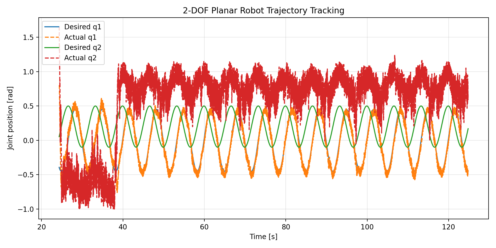
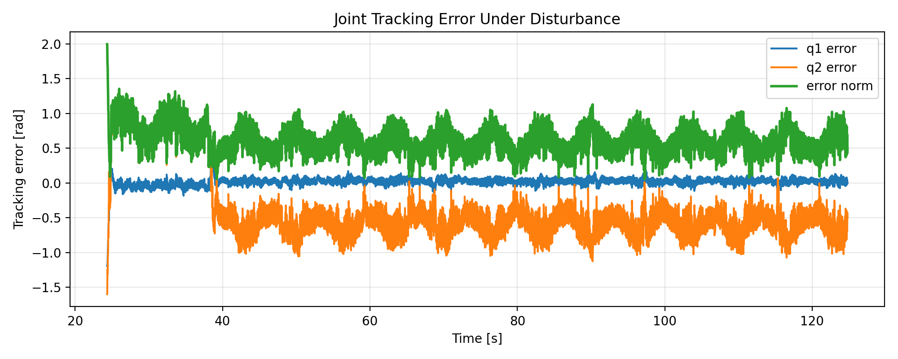

# ROS 2 Planar Robot Trajectory Tracking

A compact ROS 2 project for demonstration-trajectory replay, joint-space feedback control, simulated 2-DOF planar-robot dynamics, disturbance injection, CSV logging, and quantitative tracking analysis.

The project is intentionally small and transparent. Its purpose is to demonstrate a complete ROS 2 closed-loop control workflow rather than a high-fidelity robot, imitation-learning system, or reinforcement-learning controller.

## Highlights

- ROS 2 Python nodes built with `rclpy`
- Topic-based closed-loop control architecture
- Demonstration trajectory replay from CSV
- Joint-space PD feedback control with torque saturation
- Simulated 2-link horizontal planar-robot dynamics
- Stochastic and sinusoidal disturbance injection
- Desired/actual state logging to CSV
- Reproducible tracking plots and error analysis
- Launch-file configuration for disturbed and disturbance-free runs
- Archived experimental results for reproducibility

## Original Tuning Results

The repository includes an archived tracking run under:

[`results/original_tuning/`](results/original_tuning/)

This archive preserves the original controller-tuning experiment, including the raw CSV log and the plots generated from it. It is kept as a reproducible reference rather than presented as an optimized-performance result.

### Desired vs. actual joint trajectories



### Joint tracking error



### Archived data

| File | Description |
|---|---|
| [`tracking_results.csv`](results/original_tuning/tracking_results.csv) | Logged desired states, actual states, joint errors, and error norm |
| [`desired_vs_actual.png`](results/original_tuning/desired_vs_actual.png) | Desired and actual joint-position trajectories |
| [`tracking_error.png`](results/original_tuning/tracking_error.png) | Joint-error histories and error norm |

The CSV contains:

```text
time,desired_q1,desired_q2,actual_q1,actual_q2,error_q1,error_q2,error_norm
```

To regenerate the plots without overwriting the archived figures:

```bash
python3 scripts/plot_tracking_results.py \
  --csv results/original_tuning/tracking_results.csv \
  --output-dir results/reproduced_original_tuning
```

The plotting script also prints:

- RMSE for joint 1
- RMSE for joint 2
- mean joint-error norm

## System Architecture

```text
                    /desired_joint_states
/demo_trajectory_publisher --------------------+
                                               |
                                               v
                                      /pd_controller
                                               |
                                               | /control_torque
                                               v
                                  /planar_robot_dynamics
                                               |
                                               | /actual_joint_states
                                               +-------------------+
                                               |                   |
                                               +----> controller    |
                                                                   v
                                                    /tracking_error_logger
                                                                   |
                                                                   v
                                                        tracking CSV file
```

### ROS 2 interfaces

| Topic | Message type | Purpose |
|---|---|---|
| `/desired_joint_states` | `sensor_msgs/JointState` | Demonstration/reference trajectory |
| `/actual_joint_states` | `sensor_msgs/JointState` | Simulated robot state |
| `/control_torque` | `std_msgs/Float64MultiArray` | Two-joint torque command |

## Nodes

### `demo_trajectory_publisher`

Loads `config/demo_trajectory.csv` and publishes desired joint positions and velocities.

The trajectory file uses:

```text
time,q1,q2,q1_dot,q2_dot
```

### `pd_controller`

Subscribes to desired and actual joint states and computes a saturated joint-space PD command:

```text
tau_i = Kp_i * (q_des_i - q_i) + Kd_i * (qdot_des_i - qdot_i)
```

Current documented gains:

```text
Kp = [30.0, 12.0]
Kd = [5.0, 1.5]
torque limit = +/-20.0 N.m
```

### `planar_robot_dynamics`

Simulates a lightweight two-link robot moving in the horizontal plane:

```text
M(q) q_ddot + C(q, q_dot) + B q_dot = tau + d
```

where `d` is the injected disturbance. The state is integrated numerically inside the ROS 2 simulation node.

Default disturbance configuration documented by the project:

```text
stochastic disturbance standard deviation = 0.15
sinusoidal disturbance amplitude          = 0.25
random seed                               = 7
```

### `tracking_error_logger`

Subscribes to desired and actual joint states and writes:

```text
time,desired_q1,desired_q2,actual_q1,actual_q2,error_q1,error_q2,error_norm
```

The default runtime output is:

```text
/tmp/ros2_demo_tracking_log.csv
```

## Default Experiment Configuration

| Parameter | Value |
|---|---:|
| Trajectory publish rate | 100 Hz |
| Simulation rate | 100 Hz |
| Controller rate | 100 Hz |
| Logger rate | 50 Hz |
| `Kp` | `[30.0, 12.0]` |
| `Kd` | `[5.0, 1.5]` |
| Torque limit | `20.0 N.m` |
| Disturbance enabled | `true` |
| Disturbance std. dev. | `0.15` |
| Sinusoidal disturbance amplitude | `0.25` |

## Repository Structure

```text
ros2-planar-robot-trajectory-tracking/
├── config/
│   └── demo_trajectory.csv
├── launch/
│   └── demo_tracking.launch.py
├── resource/
├── results/
│   └── original_tuning/
│       ├── desired_vs_actual.png
│       ├── tracking_error.png
│       └── tracking_results.csv
├── ros2_demo_based_tracking/
│   ├── __init__.py
│   ├── demo_trajectory_publisher.py
│   ├── pd_controller.py
│   ├── planar_robot_dynamics.py
│   └── tracking_error_logger.py
├── scripts/
│   ├── plot_demo_trajectory.py
│   ├── plot_tracking_results.py
│   └── record_rosbag.sh
├── package.xml
├── requirements.txt
├── setup.cfg
└── setup.py
```

## Requirements

The project workflow is intended for ROS 2 on Linux with Python 3.

ROS dependencies declared by the package include:

- `rclpy`
- `sensor_msgs`
- `std_msgs`

The plotting utilities use NumPy, pandas, and Matplotlib through `requirements.txt`.

## Build

Create a ROS 2 workspace and clone the repository:

```bash
source /opt/ros/jazzy/setup.bash

mkdir -p ~/ros2_ws/src
cd ~/ros2_ws/src
git clone https://github.com/mhfakouri/ros2-planar-robot-trajectory-tracking.git
```

Install plotting dependencies:

```bash
python3 -m pip install -r \
  ~/ros2_ws/src/ros2-planar-robot-trajectory-tracking/requirements.txt
```

Build and source the workspace:

```bash
cd ~/ros2_ws
colcon build --symlink-install
source install/setup.bash
```

Confirm that ROS 2 can find the package:

```bash
ros2 pkg prefix ros2_demo_based_tracking
```

## Run

Launch the full disturbed tracking pipeline:

```bash
source /opt/ros/jazzy/setup.bash
source ~/ros2_ws/install/setup.bash

ros2 launch ros2_demo_based_tracking demo_tracking.launch.py
```

Run without disturbance:

```bash
ros2 launch ros2_demo_based_tracking demo_tracking.launch.py \
  disturbance_enabled:=false
```

Choose a different log file:

```bash
ros2 launch ros2_demo_based_tracking demo_tracking.launch.py \
  output_csv:=/tmp/my_tracking_log.csv
```

## Inspect the ROS Graph

In another sourced terminal:

```bash
ros2 topic list
```

Expected project topics include:

```text
/actual_joint_states
/control_torque
/desired_joint_states
```

Inspect a desired-state message with:

```bash
ros2 topic echo /desired_joint_states --once
```

## Plot a New Run

After collecting a run:

```bash
cd ~/ros2_ws/src/ros2-planar-robot-trajectory-tracking

python3 scripts/plot_tracking_results.py \
  --csv /tmp/ros2_demo_tracking_log.csv \
  --output-dir results/latest_run
```

This generates:

```text
results/latest_run/desired_vs_actual.png
results/latest_run/tracking_error.png
```

and prints the joint RMSE values and mean error norm.

Plot the demonstration trajectory separately with:

```bash
python3 scripts/plot_demo_trajectory.py
```

## Record a Rosbag

With the tracking system running:

```bash
ros2 bag record \
  /desired_joint_states \
  /actual_joint_states \
  /control_torque \
  -o rosbag2_demo_tracking
```

or use:

```bash
bash scripts/record_rosbag.sh
```

## Scope and Limitations

This repository is a software and simulation portfolio project.

- The robot is simulated; there is no physical-robot validation.
- The controller is a conventional PD controller, not reinforcement learning.
- The demonstration trajectory is used as a reference trajectory; this is not demonstration learning or imitation learning.
- The dynamics model is intentionally compact and represents a horizontal two-link manipulator.
- The archived `original_tuning` results document one simulation experiment and should not be interpreted as hardware performance or as a claim of optimal controller tuning.

The project focuses on ROS 2 software structure, closed-loop communication, simulation, logging, disturbance testing, and reproducible control analysis.

## Possible Extensions

Natural next steps include:

- compare original and improved controller tunings quantitatively
- compare disturbed and disturbance-free runs
- log and visualize control torque
- add model-parameter uncertainty experiments
- add Cartesian end-effector visualization
- replace the compact plant with Gazebo, MuJoCo, or another higher-fidelity simulator
- add a residual learning controller while retaining the PD controller as the nominal baseline
- validate the same ROS 2 interfaces on a physical robot

## Author

**Mohammad Hossein Fakouri**  
M.Sc. in Mechanical Engineering - Applied Design  
Interests: robotic control, learning-based control, robot simulation, and autonomous systems

## License

This project is released under the [MIT License](LICENSE).
