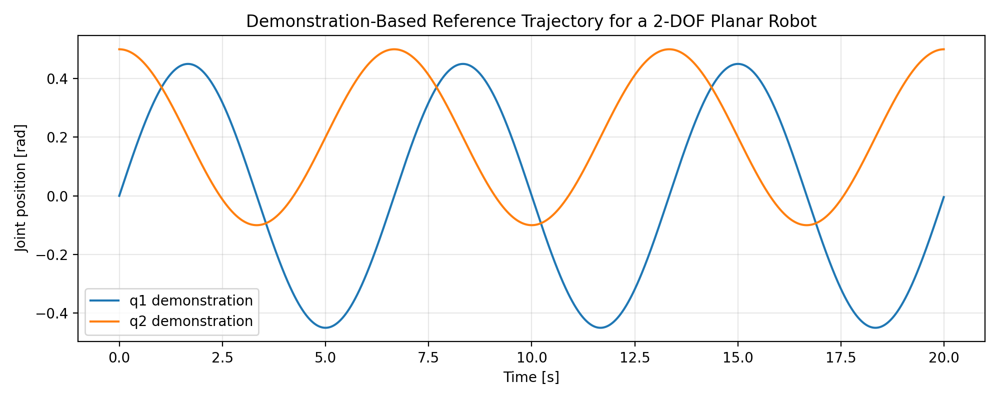
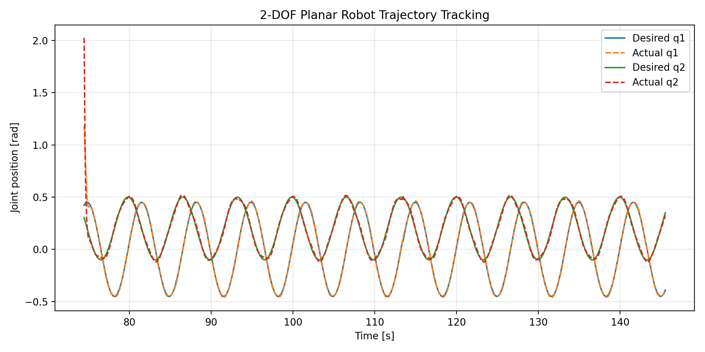
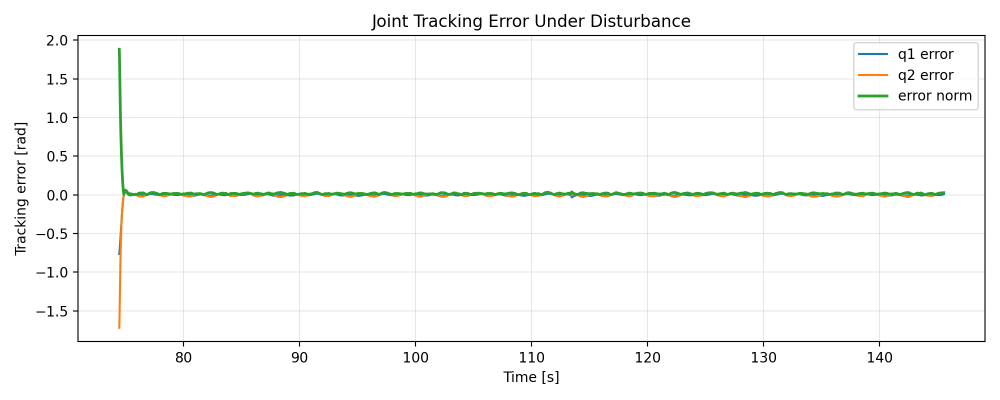

# ROS 2 Planar Robot Trajectory Tracking

A compact ROS 2 Python project demonstrating a complete closed-loop trajectory-tracking workflow for a simulated 2-DOF planar robot.

The repository combines demonstration-trajectory replay, joint-space PD feedback control, nonlinear planar-robot dynamics, disturbance injection, CSV logging, rosbag support, and reproducible tracking analysis. It is intentionally small and transparent so that the ROS 2 communication and control pipeline can be inspected end to end.

> **Scope:** this is a software-and-simulation portfolio project. The trajectory is replayed as a reference; the project does **not** implement imitation learning, reinforcement learning, or physical-robot validation.

## Highlights

- ROS 2 Python nodes built with `rclpy`
- Topic-based closed-loop control architecture
- CSV-based reference-trajectory replay
- Joint-space PD control with torque saturation
- Nonlinear 2-link horizontal planar-robot dynamics
- Stochastic and sinusoidal disturbance injection
- Semi-implicit Euler state integration
- Desired/actual joint-state logging to CSV
- Reproducible tracking plots and quantitative error metrics
- Disturbed and disturbance-free launch configurations
- Archived original and verified controller-tuning results

## Reference Trajectory

The included reference trajectory is stored in [`config/demo_trajectory.csv`](config/demo_trajectory.csv) with columns:

```text
time,q1,q2,q1_dot,q2_dot
```

It contains 2,000 trajectory points and is replayed at 100 Hz by default.



The archived reference-trajectory figure is available at [`results/reference_trajectory/demo_trajectory.png`](results/reference_trajectory/demo_trajectory.png).

## Verified Tracking Results

The verified controller run was recorded with disturbance injection enabled using the default controller and disturbance settings documented below. Metrics are computed from the complete archived CSV, including the initial convergence transient.

| Metric | Measured value |
|---|---:|
| Joint 1 RMSE | `0.03397 rad` |
| Joint 2 RMSE | `0.06120 rad` |
| Mean joint-error norm | `0.01873 rad` |
| Logged samples | `3,554` |
| Logged time span | `~71.08 s` |

### Desired vs. actual joint trajectories



### Tracking error



The complete verified dataset is stored in [`results/verified_tuning/tracking_results.csv`](results/verified_tuning/tracking_results.csv).

Its columns are:

```text
time,desired_q1,desired_q2,actual_q1,actual_q2,error_q1,error_q2,error_norm
```

To reproduce the verified plots and metrics without overwriting the archived figures:

```bash
python3 scripts/plot_tracking_results.py \
  --csv results/verified_tuning/tracking_results.csv \
  --output-dir results/reproduced_verified_tuning
```

The analysis script computes the metrics directly from the logged errors:

```text
RMSE q1
RMSE q2
mean joint-error norm
```

## System Architecture

```text
                    /desired_joint_states
/demo_trajectory_publisher --------------------+
                                               |
                                               v
                                      /pd_controller
                                               |
                                               | /control_torque
                                               v
                                  /planar_robot_dynamics
                                               |
                                               | /actual_joint_states
                                               +-------------------+
                                               |                   |
                                               +----> controller    |
                                                                   v
                                                    /tracking_error_logger
                                                                   |
                                                                   v
                                                        tracking CSV file
```

### ROS 2 Interfaces

| Topic | Message type | Purpose |
|---|---|---|
| `/desired_joint_states` | `sensor_msgs/JointState` | Reference joint positions and velocities |
| `/actual_joint_states` | `sensor_msgs/JointState` | Simulated robot state |
| `/control_torque` | `std_msgs/Float64MultiArray` | Two-joint torque command |

## Nodes

### `demo_trajectory_publisher`

Loads `config/demo_trajectory.csv` and publishes the desired joint positions and velocities on `/desired_joint_states`.

If the configured trajectory file is unavailable, the node falls back to a built-in smooth demonstration trajectory.

### `pd_controller`

Subscribes to the desired and actual joint states and computes a saturated joint-space PD torque command:

```text
tau_i = Kp_i * (q_des_i - q_i) + Kd_i * (qdot_des_i - qdot_i)
```

Current default gains:

```text
Kp = [30.0, 12.0]
Kd = [5.0, 1.5]
torque limit = +/-20.0 N.m
```

### `planar_robot_dynamics`

Simulates a lightweight two-link manipulator moving in the horizontal plane:

```text
M(q) q_ddot + C(q, q_dot) + B q_dot = tau + d
```

where:

- `M(q)` is the configuration-dependent mass matrix,
- `C(q, q_dot)` is the Coriolis/centrifugal vector,
- `B q_dot` represents viscous friction,
- `tau` is the commanded joint torque,
- `d` is the injected disturbance.

The state is advanced using semi-implicit Euler integration.

Default disturbance parameters:

```text
stochastic disturbance standard deviation = 0.15
sinusoidal disturbance amplitude          = 0.25
random seed                               = 7
```

### `tracking_error_logger`

Subscribes to desired and actual joint states and logs:

```text
time,desired_q1,desired_q2,actual_q1,actual_q2,error_q1,error_q2,error_norm
```

The default launch-file output path is:

```text
/tmp/ros2_demo_tracking_log.csv
```

The parent directory is created automatically when a custom output path is supplied.

## Default Experiment Configuration

| Parameter | Value |
|---|---:|
| Trajectory publish rate | `100 Hz` |
| Simulation rate | `100 Hz` |
| Controller rate | `100 Hz` |
| Logger rate | `50 Hz` |
| `Kp` | `[30.0, 12.0]` |
| `Kd` | `[5.0, 1.5]` |
| Torque limit | `20.0 N.m` |
| Disturbance enabled | `true` |
| Disturbance std. dev. | `0.15` |
| Sinusoidal disturbance amplitude | `0.25` |
| Random seed | `7` |

## Reproduce the Workflow

### Requirements

The commands below assume ROS 2 Jazzy on Linux with Python 3.

ROS dependencies declared by the package include:

- `rclpy`
- `sensor_msgs`
- `std_msgs`

The plotting utilities use NumPy, pandas, and Matplotlib through `requirements.txt`.

### Build

Create a ROS 2 workspace and clone the repository:

```bash
source /opt/ros/jazzy/setup.bash

mkdir -p ~/ros2_ws/src
cd ~/ros2_ws/src
git clone https://github.com/mhfakouri/ros2-planar-robot-trajectory-tracking.git
```

Install plotting dependencies:

```bash
python3 -m pip install -r \
  ~/ros2_ws/src/ros2-planar-robot-trajectory-tracking/requirements.txt
```

Build and source the workspace:

```bash
cd ~/ros2_ws
colcon build --symlink-install
source install/setup.bash
```

Confirm that ROS 2 can find the package:

```bash
ros2 pkg prefix ros2_demo_based_tracking
```

### Run

Launch the complete pipeline with disturbance injection enabled:

```bash
source /opt/ros/jazzy/setup.bash
source ~/ros2_ws/install/setup.bash

ros2 launch ros2_demo_based_tracking demo_tracking.launch.py
```

Run without disturbance:

```bash
ros2 launch ros2_demo_based_tracking demo_tracking.launch.py \
  disturbance_enabled:=false
```

Save a new run directly to a persistent results directory:

```bash
ros2 launch ros2_demo_based_tracking demo_tracking.launch.py \
  output_csv:=$HOME/ros2_ws/src/ros2-planar-robot-trajectory-tracking/results/latest_run/tracking_results.csv
```

### Inspect the ROS Graph

In another sourced terminal:

```bash
ros2 topic list
```

Expected project topics include:

```text
/actual_joint_states
/control_torque
/desired_joint_states
```

Inspect one desired-state message:

```bash
ros2 topic echo /desired_joint_states --once
```

### Plot a New Run

After collecting a run:

```bash
cd ~/ros2_ws/src/ros2-planar-robot-trajectory-tracking

python3 scripts/plot_tracking_results.py \
  --csv results/latest_run/tracking_results.csv \
  --output-dir results/latest_run
```

This creates:

```text
results/latest_run/desired_vs_actual.png
results/latest_run/tracking_error.png
```

and prints the joint RMSE values and mean error norm.

The reference trajectory can be plotted separately with:

```bash
python3 scripts/plot_demo_trajectory.py
```

## Results Archive

The repository keeps the main verified result separate from the earlier tuning experiment:

```text
results/
├── original_tuning/
│   ├── desired_vs_actual.png
│   ├── tracking_error.png
│   └── tracking_results.csv
├── reference_trajectory/
│   └── demo_trajectory.png
└── verified_tuning/
    ├── desired_vs_actual.png
    ├── tracking_error.png
    └── tracking_results.csv
```

### Original tuning

The [`results/original_tuning/`](results/original_tuning/) directory preserves an earlier controller-tuning experiment as development history. It is intentionally retained for transparency and should not be interpreted as the final verified-performance result.

<p align="center">
  
  
</p>

The corresponding raw log is available at [`results/original_tuning/tracking_results.csv`](results/original_tuning/tracking_results.csv).

## Repository Structure

```text
ros2-planar-robot-trajectory-tracking/
├── config/
│   └── demo_trajectory.csv
├── launch/
│   └── demo_tracking.launch.py
├── resource/
├── results/
│   ├── original_tuning/
│   │   ├── desired_vs_actual.png
│   │   ├── tracking_error.png
│   │   └── tracking_results.csv
│   ├── reference_trajectory/
│   │   └── demo_trajectory.png
│   └── verified_tuning/
│       ├── desired_vs_actual.png
│       ├── tracking_error.png
│       └── tracking_results.csv
├── ros2_demo_based_tracking/
│   ├── __init__.py
│   ├── demo_trajectory_publisher.py
│   ├── pd_controller.py
│   ├── planar_robot_dynamics.py
│   └── tracking_error_logger.py
├── scripts/
│   ├── plot_demo_trajectory.py
│   ├── plot_tracking_results.py
│   └── record_rosbag.sh
├── package.xml
├── requirements.txt
├── setup.cfg
└── setup.py
```

## Record a Rosbag

With the tracking system running:

```bash
ros2 bag record \
  /desired_joint_states \
  /actual_joint_states \
  /control_torque \
  -o rosbag2_demo_tracking
```

or use the included helper script:

```bash
bash scripts/record_rosbag.sh
```

## Scope and Limitations

This repository is a software and simulation portfolio project.

- The robot is simulated; there is no physical-robot validation.
- The controller is a conventional PD controller, not reinforcement learning.
- The demonstration trajectory is replayed as a reference trajectory; this is not demonstration learning or imitation learning.
- The dynamics model is intentionally compact and represents a horizontal two-link manipulator.
- The verified metrics describe one recorded simulation run under the stated controller and disturbance configuration.
- The results should not be interpreted as hardware performance or as proof of globally optimal controller tuning.

The project is intended to demonstrate ROS 2 software structure, closed-loop communication, simulation, disturbance testing, data logging, and reproducible control analysis.

## Possible Extensions

Natural next steps include:

- compare disturbed and disturbance-free runs quantitatively
- log and visualize control torque
- add model-parameter uncertainty experiments
- add Cartesian end-effector visualization
- replace the compact plant with Gazebo, MuJoCo, or another higher-fidelity simulator
- add a residual learning controller while retaining the PD controller as the nominal baseline
- validate the same ROS 2 interfaces on a physical robot

## Author

**Mohammad Hossein Fakouri**  
M.Sc. in Mechanical Engineering - Applied Design  
Interests: robotic control, learning-based control, robot simulation, and autonomous systems

## License

This project is released under the [MIT License](LICENSE).
